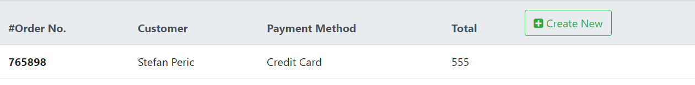
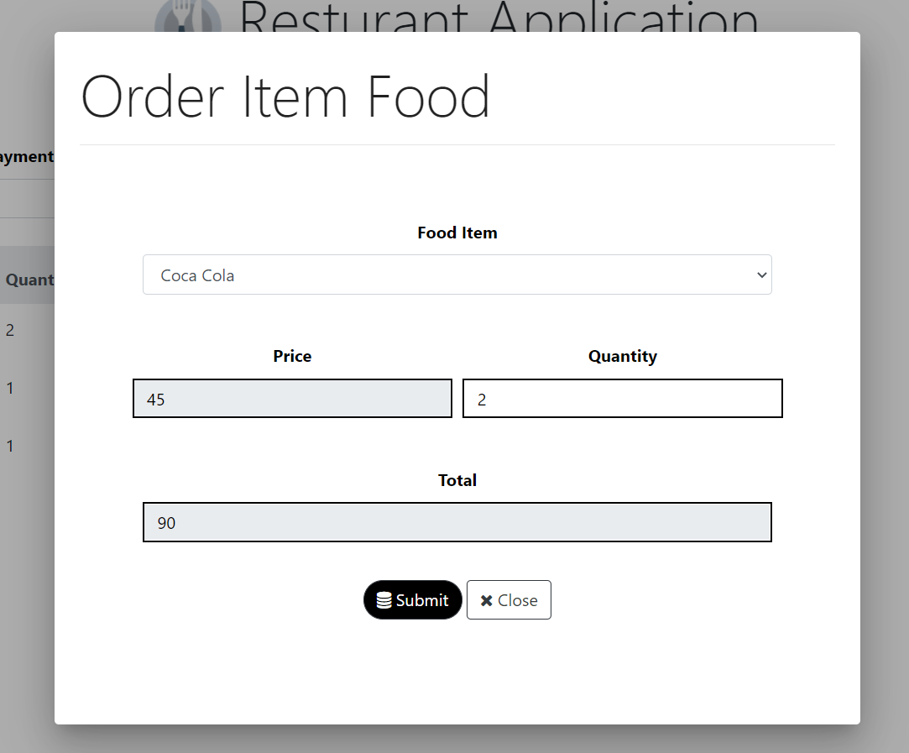

### ASP .NET Core & Angular Food Ordering applcation

#### Angular
- Services & Dependency Injection for cleaner components.
- Routing, Security Guards. 
- HTTP Client for Web Services
- Interceptor for Authorization & JWT
- Reactive forms & Template Driven forms
- Event Handling (Click), (Change) (KeyUp)...
#### .NET Core
- Web Services
- Postman Testing
- Entity Framework, Foreign Key - Constraints (table relationships)
- Tables: AspNetUser, Orders, OrderItems, Items
- .NET Core Identity & Json Web token for Authentication
-  EF queries, LINQ Joins.... 
- Mltiple rows into a table using a single SQL Server INSERT statement.

